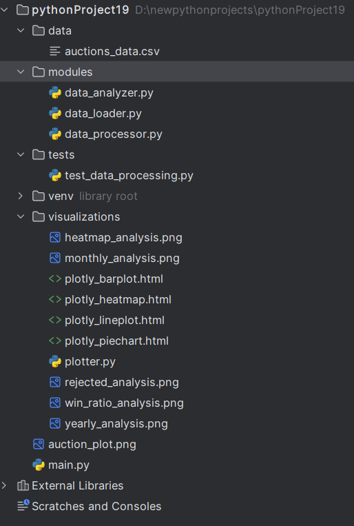
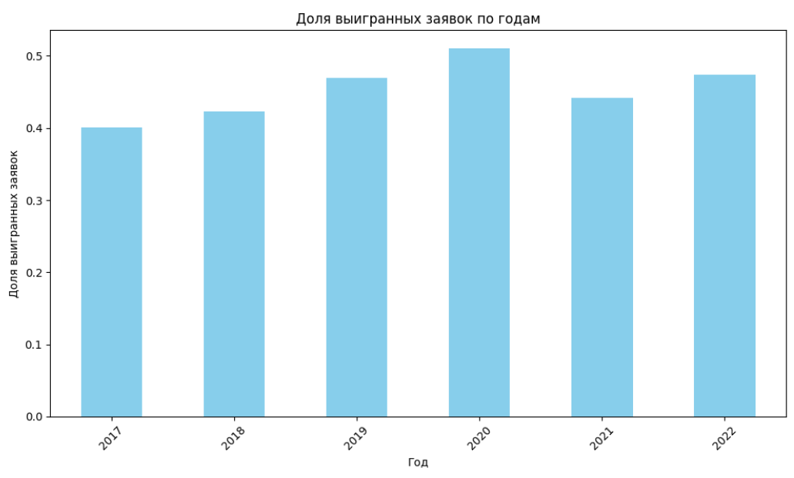
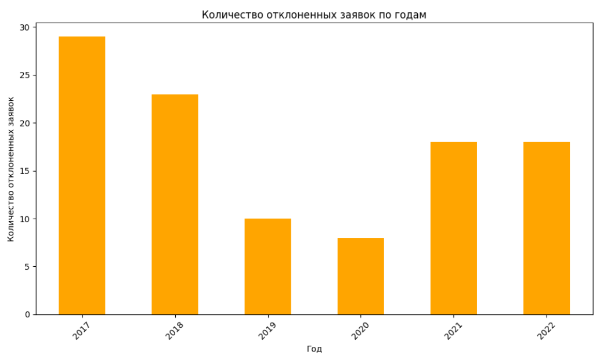
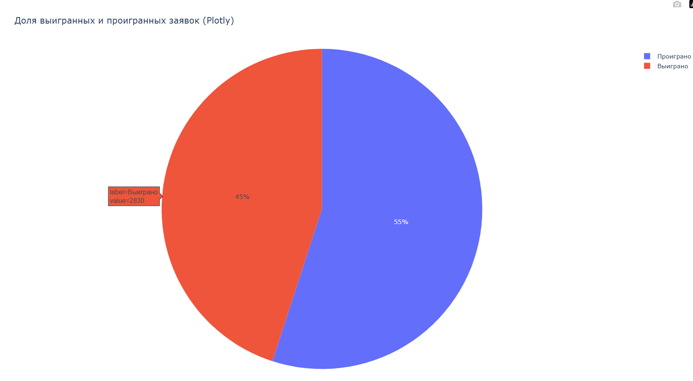

# Дипломный проект на тему: “Сравнение различных библиотек для визуализации данных: Matplotlib, 
Seaborn и Plotly: Создать набор визуализаций с использованием 
Matplotlib, Seaborn и Plotly, сравнить их функциональность и удобство 
использования. 
## Мой  проект посвящен изучению и сравнению трех ключевых 
библиотек для визуализации данных: Matplotlib, Seaborn и Plotly. Эти 
библиотеки представляют собой эволюцию инструментов для 
визуализации — от низкоуровневых (Matplotlib) до высокоуровневых и 
интерактивных (Plotly). В работе я  намерен показать, как каждая из них 
справляется с задачами визуализации, и сделать выводы об их удобстве, 
функциональности и применимости в реальных проектах.
## Демонстрация работы
### Главное окно:

.png)

